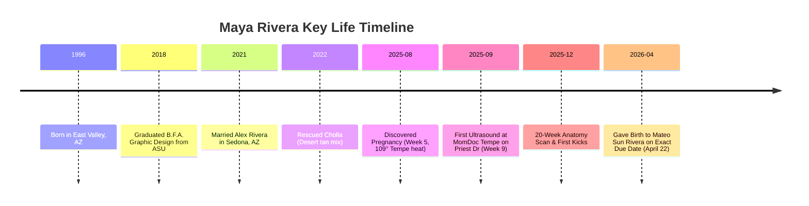

# Character Research & Biography: Maya Rivera

> **File Path**: `docs/character/01_maya_rivera_biography.md`  
> **Subject**: Maya Rivera (Protagonist)  
> **Role**: Freelance Graphic Designer & First-Time Mother  
> **Location**: Tempe, Arizona  
> **Date of Birth**: March 14, 1996 (Age 29 during pregnancy)  

---

## 1. Executive Summary

**Maya Rivera** is a 29-year-old Mexican-American freelance graphic designer living in Tempe, Arizona. She is married to **Alex Rivera** (30, software engineer) and has a rescue dog named **Cholla**. Maya is pregnant with her first child, **Mateo Sun Rivera**, due April 22, 2026.

Maya represents the modern East Valley creative: grounded, visually intuitive, deeply connected to her family and desert surroundings, and navigating the transition into motherhood with honesty, vulnerability, and humor.

---

## 2. Personal History & Background

### Early Life & Upbringing
* **Roots**: Born and raised in the East Valley (Mesa/Tempe border). Second-generation Mexican-American.
* **Family Context**: Her mother ("Mama") lives nearby in Mesa and remains a constant, comforting presence—frequently stopping by with homemade chicken broth, warm advice, and gentle cultural reminders (*"tienes que comer, mija"*).
* **Cultural Identity**: Maya’s Mexican-American heritage is an organic part of her daily life, expressed naturally through food, family interactions, and Spanish terms of endearment, without ever feeling like an artificial culture lesson or stereotype.

### Education & Career
* **Education**: B.F.A. in Graphic Design from Arizona State University (ASU Herberger Institute for Design and the Arts), graduating in 2018.
* **Career**: Freelance graphic designer operating under her independent studio. She specializes in brand identity, typography, packaging, and custom illustrations for local Arizona small businesses, artisan coffee shops, boutiques, and eco-friendly brands.
* **Work Style**: Operates out of a sunlit home studio in South Tempe, equipped with a drafting table, digital tablet, laptop, potted succulents, and a cozy floor dog bed for Cholla.

---

## 3. Aesthetic & Creative Philosophy

* **Visual Taste**: Desert modernism, warm earth tones (terracotta, Sonoran sage, warm sand, raw clay, natural linen), organic botanical motifs, clean typography with classic serif accents.
* **Values**: Authenticity, low-intervention living, tactile materials, community support for local East Valley businesses.
* **Personal Style**: High-waisted linen trousers, soft cotton t-shirts, sunbaked terracotta sweaters, simple gold bar necklace, natural wavy espresso-brown hair.

---

## 4. Key Life Events Timeline

---

## 5. Daily Life & Routines in Tempe

* **Morning Routine**: Morning walks with Cholla at Kiwanis Park lake trails before the desert heat hits; making iced ginger lemon tea or pour-over coffee; checking design client emails.
* **Afternoon Work**: Drafting logo concepts and brand systems in her studio; taking short stretches; phone consultations with local clients along Mill Avenue and College Avenue.
* **Evening Routine**: Sunset walks along Tempe Town Lake pedestrian bridge with Alex; cooking home meals; relaxing on their living room couch with Cholla resting her chin on Maya's growing bump.
