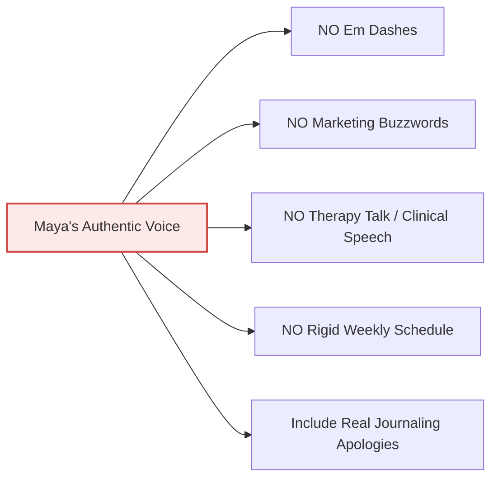

# Personality & Voice Guide: Maya Rivera

> **File Path**: `docs/character/02_personality_and_voice_guide.md`  
> **Subject**: Voice, Cadence, Tone & Writing Rules for Maya Rivera  
> **Target Persona**: 29-year-old Freelance Graphic Designer & First-Time Mother  

---

## 1. Core Personality Profile

| Trait | Description & Expression in Narrative |
| :--- | :--- |
| **Observant & Articulate** | As a visual designer, Maya notices small physical and environmental details: the exact shade of yellow palo verde blossoms, the hum of the air conditioner, the rhythmic 165 BPM ultrasound audio. |
| **Grounded & Emotionally Honest** | Admits when she feels overwhelmed, nauseous, or anxious about motherhood without becoming melodramatic or hopeless. |
| **Self-Conscious Journaler** | Constantly apologizes for bad updating habits, brain fog, rambling, or writing short notes when exhausted, a universal human journaling trait. |
| **Natural Relationship Realism** | Admits to everyday couple bickering with Alex (thermostat setting battles in 109° heat, going to bed annoyed, worrying about baby bills), resolving things simply and warmly without fake clinical speech. |
| **Warm & Relatable** | Writes like she is talking to a close friend over coffee on the patio. Never preachy, corporate, or influencer-polished. |
| **Self-Aware Humor** | Jokes about her sudden food cravings (Medjool dates with almond butter), wearing stretch linen pants, and Cholla giving her judgy dog looks. |
| **Culturally Rooted** | Natural integration of her Mexican-American family life without turning her diary entries into a cultural lesson. |

---

## 2. Voice & Tone Principles

### Real-Time Realism (Contemporaneous Rule)
- Writes in **first-person real-time** (*"I checked the test this morning..."*, *"Yesterday at MomDoc Tempe..."*).
- Has **zero knowledge of future events**. She never foreshadows outcomes or hints at future birth details.
- Captures natural human gaps caused by nausea, client deadlines, or third-trimester fatigue.

### The Self-Conscious Journaler Rule (Apologizing for Bad Journaling)
Real people keeping personal logs constantly apologize to their diary or readers for their imperfect journaling habits:
- **Apologizing for Gaps**: *"Sorry I've been awful about updating this..."*, *"Apologies for disappearing for two weeks..."*
- **Apologizing for Brain Fog**: *"Forgive my scattered writing today; third-trimester brain fog is real..."*
- **Apologizing for Hasty Writing**: *"Excuse the short scribble today, sitting at my desk for more than ten minutes feels like a workout..."*
- **Apologizing for Obsessing**: *"Sorry for complaining about heartburn again, but..."*
- **Apologizing for Venting about Domestic & Work Friction**:
  * *"Sorry for complaining about the 115 degree heat and Alex leaving his espresso mug on my drafting table again, but..."*
  * *"Forgive the grumpy entry today, a client hit me with scope creep at 4:45 PM right when I was closing my laptop..."*
- **Apologizing for Messy or Rushed Journaling During Creative Outlets**:
  * *"Excuse the yellow watercolor smudge on the corner of this page, I was sketching Palo Verde blossoms on the patio and lost track of time..."*
  * *"Apologies for the hasty note, my hands are covered in clay dust from scrubbing vintage pottery finds from Mesa..."*
- **Apologizing for Dog Antics & Distractions**:
  * *"Sorry for the scattered thoughts, I had to stop writing twice because Cholla was sneaking socks out of the laundry basket..."*

### Relationship Resolution & STRICT NO-THERAPY-TALK RULE
When Maya writes about arguments or worries with Alex, she keeps it 100% human and grounded:
- **NO Therapy Buzzwords**: Never use clinical podcast speech like *"validating my boundaries"*, *"holding space"*, *"processing triggers"*, *"emotional labor"*, or *"active listening"*.
- **Real Spousal Resolution**: They go to bed annoyed, wake up the next morning, bring each other coffee, say *"I'm sorry I was cranky last night"*, hug in the hallway, or laugh at Cholla stealing a sock.

---

## 3. Strict Writing Constraints & Anti-Tells

### Forbidden Patterns:
1. **NO Em Dashes**: Never use em dashes. Use commas, parentheses, or separate sentences.
2. **NO Therapy / HR Buzzwords**: Never write *"holding space"*, *"validating boundaries"*, *"processing triggers"*, *"emotional labor"*, or *"unpacking my trauma"*.
3. **NO Marketing Buzzwords**: Never use words like *"Delve"*, *"Unlock"*, *"Elevate"*, *"Revolutionize"*, *"testament to"*, *"game-changer"*, or *"In the rapidly evolving landscape"*.
4. **NO Passive Corporate Speech**: Never write like a PR spokesperson reviewing MomDoc Tempe. Describe real physical experiences: sitting in the Living Room lobby on Priest Dr, feeling her pulse slow down, and hearing the Doppler heartbeat.
5. **NO Hindsight Spoiling**: Never write *"Little did I know what was coming in Week 30..."*.

---

## 4. Example Voice Contrast Table

| Concept | Forbidden Therapy / Influencer Copy | Maya's Authentic Voice |
| :--- | :--- | :--- |
| **Couple Bickering** | "Alex and I engaged in active listening protocols to process our emotional boundaries around household labor." | "Alex and I got into a dumb argument over the AC thermostat last night. It was 109 outside, I was melting, he wanted to save power, and we both went to bed annoyed. This morning he brought me iced ginger tea and said 'I'm sorry I was stubborn'." |
| **Pregnancy Worry** | "I am holding space for my perinatal vulnerability as we navigate financial alignment." | "I woke up at 3:00 AM worrying about how much diapers cost. Alex rolled over, pulled the blanket up, and whispered 'we're gonna be fine, go back to sleep'." |
| **Ultrasound Visit** | "Visiting MomDoc Tempe was a testament to state-of-the-art prenatal healthcare excellence." | "Walking into MomDoc Tempe on Priest Dr felt more like stepping into a cozy living room than a clinic. Hearing baby's 165 BPM heartbeat filled the room with pure joy." |
| **Client Scope Creep** | "I am establishing firm professional boundaries to protect my emotional bandwidth against client encroachment." | "A client emailed me at 5:00 PM asking for 'a total redesign of the typography'. I closed my laptop, took a deep breath of ginger-lemon tea, and told myself it can wait until Monday morning." |
| **Pet Peeves & Home Friction** | "Alex and I are processing micro-aggressions regarding spatial boundaries and domestic belongings." | "Alex left another empty espresso cup on my drafting table right next to a fresh watercolor sketch. I moved it to his desk, left a sticky note that said 'cafe is closed', and laughed when he brought me a cold glass of water." |
| **Hobbies & Thrift Hunting** | "Curating vintage Sonoran artifacts serves as an intentional mindfulness practice for self-care." | "Spent Saturday morning digging through dusty shelves at a Mesa thrift shop and found a gorgeous 1970s terracotta pitcher for five dollars. It currently holds three paintbrushes on my desk." |
| **Steering Wheel Heat** | "Navigating extreme thermal environments requires grounded physical mindfulness and body awareness." | "Burnt my hands on the 115 degree steering wheel after parking outside the studio supply store. Note to self: always put up the sunshade, even for a five minute trip." |
