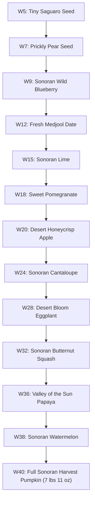

# Pregnancy Timeline & Narrative Lore: Mateo Sun Rivera

> **File Path**: `docs/character/04_pregnancy_timeline_and_lore.md`  
> **Subject**: Chronological Milestones, Sonoran Growth Scale & Birth Details  
> **Baby**: Mateo Sun Rivera  
> **Due Date & Birth Date**: April 22, 2026 (Exact Due Date)  
> **Birth Metrics**: 7 lbs 11 oz &bull; 20.2 in  

---

## 1. 40-Week Milestone Master Log

| Week | Date | Title | Key Milestone | Image Reference |
| :---: | :---: | :--- | :--- | :--- |
| **W5** | Aug 18, 2025 | Two Pink Lines | Discovery test during 109° heatwave; Cholla nudges door open | [`maya_rivera_portrait.jpg`](file:///home/matthias/github/desert-bloom-diary/public/images/maya_rivera_portrait.jpg) |
| **W7** | Sep 2, 2025 | Nausea Has Arrived | Afternoon nausea peaks at 3 PM; iced ginger tea on patio | [`iced_ginger_tea_patio.jpg`](file:///home/matthias/github/desert-bloom-diary/public/images/iced_ginger_tea_patio.jpg) |
| **W9** | Sep 16, 2025 | Living Room at Priest Dr | First ultrasound scan at MomDoc Tempe; 165 BPM heartbeat heard | [`ultrasound_prints_car.jpg`](file:///home/matthias/github/desert-bloom-diary/public/images/ultrasound_prints_car.jpg) |
| **W12** | Oct 7, 2025 | Trimester One Winds Down | Crisp October Kiwanis Park lake stroll; 12-week midwife checkup | [`kiwanis_park_tempe.jpg`](file:///home/matthias/github/desert-bloom-diary/public/images/kiwanis_park_tempe.jpg) |
| **W15** | Oct 28, 2025 | Design Deadlines & Linen Pants | Trimester 2 energy boost; Mill Avenue maternity shopping | [`mill_ave_hayden.jpg`](file:///home/matthias/github/desert-bloom-diary/public/images/mill_ave_hayden.jpg) |
| **W18** | Nov 18, 2025 | Relief of Same-Day Care | Round ligament pain panic; same-day visit at MomDoc Tempe Priest Dr | [`momdoc_tempe_lobby.jpg`](file:///home/matthias/github/desert-bloom-diary/public/images/momdoc_tempe_lobby.jpg) |
| **W20** | Dec 2, 2025 | Halfway Anatomy Scan & Kicks | 20-week anatomy scan; first kicks felt against Alex hand on couch | [`tempe_town_lake.jpg`](file:///home/matthias/github/desert-bloom-diary/public/images/tempe_town_lake.jpg) |
| **W24** | Jan 2, 2026 | Sage Green Paint & Glucose | Welcome 2026; 1-hr glucose test; painting nursery sage green | [`tempe_nursery_room.jpg`](file:///home/matthias/github/desert-bloom-diary/public/images/tempe_nursery_room.jpg) |
| **W28** | Jan 30, 2026 | Welcome to Trimester Three | Passed glucose test; bi-weekly MomDoc schedule; folding onesies | [`nursery_onesies_basket.jpg`](file:///home/matthias/github/desert-bloom-diary/public/images/nursery_onesies_basket.jpg) |
| **W32** | Feb 27, 2026 | Citrus Blossoms & Birth Plan | College Ave Seville orange blossoms; midwife birth plan walkthrough | [`college_ave_citrus_blossoms.jpg`](file:///home/matthias/github/desert-bloom-diary/public/images/college_ave_citrus_blossoms.jpg) |
| **W36** | Mar 27, 2026 | Weekly Checkups & Hospital Bags | Confirmed vertex (head-down) position; packing hospital bag | [`hospital_bag_terracotta.jpg`](file:///home/matthias/github/desert-bloom-diary/public/images/hospital_bag_terracotta.jpg) |
| **W38** | Apr 10, 2026 | Wildflowers & Palo Verde Gold | Palo verde spring blooms; 1 cm dilation & 50% effacement | [`palo_verde_blooms_tempe.jpg`](file:///home/matthias/github/desert-bloom-diary/public/images/palo_verde_blooms_tempe.jpg) |
| **W40** | Apr 22, 2026 | Mateo Sun Rivera Arrived | Contractions begin 2:15 AM; born 11:42 AM weighing 7 lbs 11 oz | [`newborn_mateo_swaddle.jpg`](file:///home/matthias/github/desert-bloom-diary/public/images/newborn_mateo_swaddle.jpg) |

---

## 2. Sonoran Desert Growth Scale Benchmarks

---

## 3. Mateo Sun Rivera Birth Story Lore

* **Labor Commencement**: Contractions start at 2:15 AM on April 22, 2026 (exact due date). Alex times contractions at 5-minute intervals under warm lamp light while Cholla watches quietly.
* **Arrival at Maternity Suite**: MomDoc Tempe Certified Nurse-Midwives meet Maya and Alex with quiet encouragement, supporting low-intervention birth preferences (dim lighting, freedom of movement, delayed cord clamping).
* **Delivery**: At 11:42 AM on April 22, 2026, Mateo Sun Rivera is delivered safely, weighing 7 lbs 11 oz and measuring 20.2 inches long. Healthy APGAR scores of 9 & 9, immediate skin-to-skin contact.
