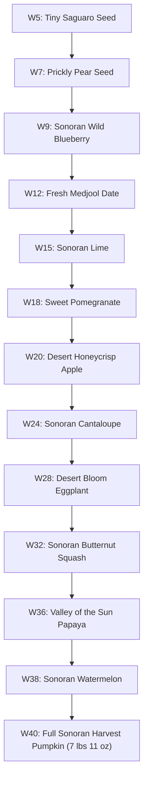

# Pregnancy Timeline & Narrative Lore: Mateo Sun Rivera

> **File Path**: `docs/character/04_pregnancy_timeline_and_lore.md`  
> **Subject**: Chronological Milestones, Sonoran Growth Scale & Birth Details  
> **Baby**: Mateo Sun Rivera  
> **Due Date & Birth Date**: April 22, 2026 (Exact Due Date)  
> **Birth Metrics**: 7 lbs 11 oz &bull; 20.2 in  

---

## 1. 40-Week Milestone Master Log

| Week | Date | Title | Key Milestone & R1 Lore Integration | Image Reference |
| :---: | :---: | :--- | :--- | :--- |
| **W5** | Aug 18, 2025 | Two Pink Lines | Discovery test during 109° heatwave; smart thermostat war (74° vs 77°); Cholla (2022 Salt River rescue) nudges door open & steals laundry sock; 115° steering wheel burn driving to pharmacy | [`maya_rivera_portrait.jpg`](file:///home/matthias/github/desert-bloom-diary/public/images/maya_rivera_portrait.jpg) |
| **W7** | Sep 2, 2025 | Nausea Has Arrived | Afternoon nausea peaks at 3 PM settled with iced ginger tea on patio; Alex manual lever espresso shot glass left on drafting table near watercolor palette | [`iced_ginger_tea_patio.jpg`](file:///home/matthias/github/desert-bloom-diary/public/images/iced_ginger_tea_patio.jpg) |
| **W9** | Sep 16, 2025 | Living Room at Priest Dr | First ultrasound scan at MomDoc Tempe (165 BPM heartbeat); Alex morning Papago Park trail ride; late-night Mesa taco truck birria celebration | [`ultrasound_prints_car.jpg`](file:///home/matthias/github/desert-bloom-diary/public/images/ultrasound_prints_car.jpg) |
| **W12** | Oct 7, 2025 | Trimester One Winds Down | Crisp October Kiwanis Park lake picnic under pecan trees; plein air botanical watercolor sketching; Mesa thrift store vintage pottery hunting | [`kiwanis_park_tempe.jpg`](file:///home/matthias/github/desert-bloom-diary/public/images/kiwanis_park_tempe.jpg) |
| **W15** | Oct 28, 2025 | Design Deadlines & Linen Pants | Trimester 2 energy boost; client scope creep before date night; indie matinee at Valley Art Theater on Mill Ave; Cholla rests chin on bump | [`mill_ave_hayden.jpg`](file:///home/matthias/github/desert-bloom-diary/public/images/mill_ave_hayden.jpg) |
| **W18** | Nov 18, 2025 | Relief of Same-Day Care | Round ligament pain panic; same-day visit at MomDoc Tempe Priest Dr; balancing design deadlines with Alex late-night PagerDuty engineering alerts | [`momdoc_tempe_lobby.jpg`](file:///home/matthias/github/desert-bloom-diary/public/images/momdoc_tempe_lobby.jpg) |
| **W20** | Dec 2, 2025 | Halfway Anatomy Scan & Kicks | 20-week anatomy scan; first kicks felt on couch; Tempe Town Lake pedestrian bridge sunset walk; Cholla hoarding clean socks in nursery corner | [`tempe_town_lake.jpg`](file:///home/matthias/github/desert-bloom-diary/public/images/tempe_town_lake.jpg) |
| **W24** | Jan 2, 2026 | Sage Green Paint & Glucose | Welcome 2026; 1-hr glucose test; assembling IKEA nursery drawers without instructions; painting sage green walls & setting thrift pottery | [`tempe_nursery_room.jpg`](file:///home/matthias/github/desert-bloom-diary/public/images/tempe_nursery_room.jpg) |
| **W28** | Jan 30, 2026 | Welcome to Trimester Three | Passed glucose test; bi-weekly MomDoc schedule; folding onesies; iced ginger-lemon tea; brain fog from Alex 2 AM cloud deployment PagerDuty call | [`nursery_onesies_basket.jpg`](file:///home/matthias/github/desert-bloom-diary/public/images/nursery_onesies_basket.jpg) |
| **W32** | Feb 27, 2026 | Citrus Blossoms & Birth Plan | College Ave Seville orange blossom walks; midwife birth plan walkthrough; Alex decaf pour-over brewing & hospital route planning | [`college_ave_citrus_blossoms.jpg`](file:///home/matthias/github/desert-bloom-diary/public/images/college_ave_citrus_blossoms.jpg) |
| **W36** | Mar 27, 2026 | Weekly Checkups & Hospital Bags | Confirmed vertex position; packing terracotta hospital bag; Cholla hiding stolen baby sock; Alex wrapping up on-call rotation swap | [`hospital_bag_terracotta.jpg`](file:///home/matthias/github/desert-bloom-diary/public/images/hospital_bag_terracotta.jpg) |
| **W38** | Apr 10, 2026 | Wildflowers & Palo Verde Gold | Palo verde spring blooms; patio botanical watercolor painting; 1 cm dilation & 50% effacement; quiet Kiwanis Park lake strolls | [`palo_verde_blooms_tempe.jpg`](file:///home/matthias/github/desert-bloom-diary/public/images/palo_verde_blooms_tempe.jpg) |
| **W40** | Apr 22, 2026 | Mateo Sun Rivera Arrived | Contractions begin 2:15 AM; Alex timing contractions & offering ginger tea sips; born 11:42 AM weighing 7 lbs 11 oz | [`newborn_mateo_swaddle.jpg`](file:///home/matthias/github/desert-bloom-diary/public/images/newborn_mateo_swaddle.jpg) |

---

## 2. Sonoran Desert Growth Scale Benchmarks

---

## 3. Mateo Sun Rivera Birth Story Lore

* **Labor Commencement**: Contractions start at 2:15 AM on April 22, 2026 (exact due date). Alex times contractions at 5-minute intervals under warm lamp light while Cholla watches quietly.
* **Arrival at Maternity Suite**: MomDoc Tempe Certified Nurse-Midwives meet Maya and Alex with quiet encouragement, supporting low-intervention birth preferences (dim lighting, freedom of movement, delayed cord clamping).
* **Delivery**: At 11:42 AM on April 22, 2026, Mateo Sun Rivera is delivered safely, weighing 7 lbs 11 oz and measuring 20.2 inches long. Healthy APGAR scores of 9 & 9, immediate skin-to-skin contact.

---

## 4. Release 1 Narrative & Lore Mapping Across Timeline (Weeks 5 to 40)

### Week 5: Two Pink Lines & Summer Heatwave
* **Date**: August 18, 2025
* **Medical / Milestone**: Positive test discovery during 109° Tempe heatwave.
* **Hobbies & Daily Life**: Maya brewing cold water while coping with sudden heat fatigue.
* **Domestic & Tech Friction**: Alex smart home automation maintains 74° indoor cooling while Maya shivers under a linen throw blanket at her preferred 77°.
* **Pet Peeves**: Burning palms on a 115° leather steering wheel after parking under the Tempe summer sun to grab a confirmation test.
* **Cholla Lore**: Cholla (rescued autumn 2022 near Salt River as a wheat-tan desert stray) nudges open the bathroom door, rests her chin on Maya's knee, and steals a clean white laundry sock.

### Week 7: Nausea & Morning Rituals
* **Date**: September 2, 2025
* **Medical / Milestone**: Afternoon nausea peaks around 3 PM.
* **Hobbies & Daily Life**: Maya relies on iced ginger-lemon herbal teas brewed on the patio to settle digestive waves.
* **Alex's Hobbies & Pet Peeves**: Alex's morning manual lever espresso brewing creates strong aromas. Alex leaves his spent espresso shot glass on Maya's wooden drafting table right beside her active Sonoran botanical watercolor washes.

### Week 9: Ultrasound Scan & Shared Date Night
* **Date**: September 16, 2025
* **Medical / Milestone**: First ultrasound scan at MomDoc Tempe (1634 S. Priest Dr); hearing 165 BPM heartbeat.
* **Alex's Hobbies**: Alex mountain biking early morning at Papago Park trail loops to manage nervous energy before the scan.
* **Tempe Date Spots**: Celebrating the clear ultrasound with a late-night Mesa taco truck run for birria and carne asada tacos.

### Week 12: Trimester One Wrap & Autumn Outings
* **Date**: October 7, 2025
* **Medical / Milestone**: 12-week midwife checkup; trimester one conclusion.
* **Tempe Date Spots**: Crisp October picnic at Kiwanis Park lake under pecan shade trees.
* **Maya's Hobbies**: Maya packing her spiral-bound watercolor journal for plein air botanical sketching of saguaro ribs and desert flora. Spending Saturday morning vintage pottery hunting at East Valley thrift shops in Mesa and Chandler.

### Week 15: Second Trimester Boost & Career Friction
* **Date**: October 28, 2025
* **Medical / Milestone**: Energy returning; maternity linen pants transition.
* **Pet Peeves & Career Drama**: Freelance client scope creep requesting last-minute layout tweaks right before a planned Friday date night.
* **Tempe Date Spots**: Unwinding with an indie matinee at Valley Art Theater on Mill Ave after submitting client revisions.
* **Cholla Lore**: Cholla resting her chin directly on Maya's growing 15-week bump while relaxing on the sofa.

### Week 18: Reassurance Visit & On-Call Balance
* **Date**: November 18, 2025
* **Medical / Milestone**: Round ligament pain panic leading to a same-day triage visit at MomDoc Tempe Priest Dr clinic.
* **Domestic & Career Drama**: Balancing client design deadlines with Alex's late-night software engineering PagerDuty alerts. Alex answering 2 AM system outage calls while Maya attempts to rest.

### Week 20: Anatomy Scan & Nesting Start
* **Date**: December 2, 2025
* **Medical / Milestone**: 20-week anatomy scan; feeling first baby kicks against Alex's hand.
* **Tempe Date Spots**: Sunset walk across Tempe Town Lake pedestrian bridge followed by a stroll along College Ave.
* **Cholla Lore & Pet Peeves**: Cholla inspecting nursery closet corners and hoarding stolen clean wool socks in her dog bed.

### Week 24: Nursery Painting & IKEA Assembly Drama
* **Date**: January 2, 2026
* **Medical / Milestone**: 1-hour glucose screening; nursery transformation.
* **Maya's Hobbies**: Painting nursery accent walls in Sonoran sage green and styling shelves with thrifted East Valley terracotta pottery.
* **Domestic Drama**: Assembling IKEA nursery drawers without reading instruction manuals. Alex insisting he understands dowel placement while Maya keeps count of remaining hardware.
* **Pet Peeves**: Alex leaving an empty coffee mug on Maya's freshly painted drop cloth.

### Week 28: Third Trimester & Brain Fog
* **Date**: January 30, 2026
* **Medical / Milestone**: Passing glucose test; moving to bi-weekly MomDoc midwife visits.
* **Hobbies & Daily Life**: Iced ginger-lemon tea sipping while folding sage green onesies.
* **Domestic & Voice Lore**: Self-conscious journaling apologies about pregnancy brain fog after Alex suffers three middle-of-the-night PagerDuty deployment pages.
* **Cholla Lore**: Cholla nudging open bathroom doors and resting her chin on Maya's 28-week bump.

### Week 32: Citrus Blossoms & Birth Planning
* **Date**: February 27, 2026
* **Medical / Milestone**: Birth plan walkthrough with MomDoc midwives.
* **Tempe Date Spots**: Walking along College Ave enjoying the fragrance of Seville orange citrus blossoms.
* **Alex's Hobbies**: Alex perfecting decaf pour-over brewing while mapping hospital routes and smart home heating schedules.

### Week 36: Hospital Bags & Final Preparations
* **Date**: March 27, 2026
* **Medical / Milestone**: Vertex position confirmed; weekly checkups starting.
* **Cholla Lore & Pet Peeves**: Packing terracotta hospital bag while Cholla tries to sneak a tiny baby sock into her floor bed.
* **Pet Peeves**: Managing 95° early heat and keeping windshield sunshades in place to avoid 115° steering wheel burns.
* **Domestic Balance**: Alex coordinating on-call coverage with engineering teammates to remain off-call during the delivery window.

### Week 38: Palo Verde Bloom & Gentle Waiting
* **Date**: April 10, 2026
* **Medical / Milestone**: 1 cm dilation and 50% effacement noted at MomDoc Tempe.
* **Maya's Hobbies**: Painting yellow Palo Verde spring blossoms from the back patio watercolor station.
* **Tempe Date Spots**: Slow afternoon strolls at Kiwanis Park lake, pausing during mild Braxton Hicks contractions.

### Week 40: Delivery & Mateo's Birth
* **Date**: April 22, 2026
* **Medical / Milestone**: Labor begins 2:15 AM; delivery at 11:42 AM weighing 7 lbs 11 oz.
* **Domestic Support**: Alex timing contractions on his phone app and offering sips of iced ginger-lemon tea.
* **Cholla Lore**: Cholla watching quietly from bedroom doorway as hospital bags are loaded.
* **Lore Resolution**: Successful delivery of baby Mateo Sun Rivera surrounded by family support.
