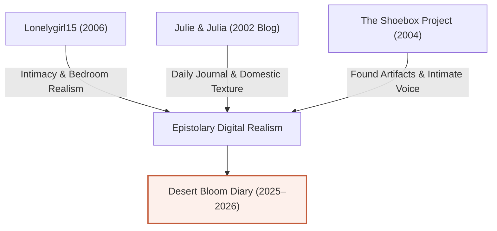

# Desert Bloom Diary: Vision, Artistic Analysis & Conceptual Grounding

> **Author**: Senior Systems Engineer & Creative Director  
> **Project**: Desert Bloom Diary (`desert-bloom-maya`)  
> **Subject**: Maya Rivera’s Contemporaneous 40-Week Tempe Pregnancy Journal  
> **Date**: August 12, 2026  

---

## 1. Core Thesis & Mission

**Desert Bloom Diary** is a digital epistolary narrative and local resource experience. It tells the story of **Maya Rivera**, a 29-year-old Mexican-American freelance graphic designer living in Tempe, Arizona, navigating her first pregnancy alongside her husband Alex (a software engineer) and their rescue dog Cholla, supported by the care team at **MomDoc Tempe** (`1634 S. Priest Dr., Tempe, AZ 85281`).

The goal is to solve a fundamental human need: **providing authentic, non-corporate, trauma-informed companionship for pregnancy**. 

Instead of presenting an over-curated Instagram feed or a clinical medical portal, *Desert Bloom* functions as a real-time living journal written week by week, capturing the warmth, anxiety, physical changes, local Arizona realities, and small everyday victories of expecting a child.

---

## 2. The Creative Conceit: Strict Contemporaneous Voice

The defining narrative rule of *Desert Bloom* is **Zero Hindsight**:
* Every entry is written strictly in the real-time voice of Maya on the exact date listed in the frontmatter.
* Maya has zero knowledge of future outcomes, gender reveals, birth complications, or exact birth timing.
* When she writes in Week 5, she does not know if she will experience hyperemesis. When she writes in Week 18 about a sudden pelvic twinge, she is genuinely scared until her same-day appointment at MomDoc Tempe confirms it is round ligament pain.
* **Natural Human Cadence**: Normal human beings do not post on an automated, rigid clock. Maya skips two weeks during peak first-trimester nausea; she pauses writing during a heavy freelance branding deadline in October; she writes casually after a walk at Kiwanis Park.

---

## 3. Comparative Art Analysis: *Lonelygirl15* and Web-Native Epistolary Realism

To understand what makes *Desert Bloom* work (and where digital storytelling often fails), we must examine key milestones in web-native personal narratives:

### A. *Lonelygirl15* (2006)
* **The Spark**: When *Lonelygirl15* (Bree) first appeared on YouTube in 2006, millions of viewers tuned in not because of high production values, but because of **intimate, room-bound authenticity**. Bree sat on her bed, talked to her webcam, complained about her parents, and showed her messy bedroom.
* **Where It Succeeded**: It made viewers feel like they had stumbled upon someone's real private sanctuary. The cadence felt unscripted, raw, and deeply human.
* **Where It Lost Its Way**: The creators eventually introduced sci-fi cult storylines, elaborate secret societies, and theatrical melodrama. The moment the audience realized it was a scripted ARG rather than a real teenager's bedroom diary, the magic shifted from personal connection to spectacle.
* **The Lesson for Desert Bloom**: **Stay grounded in the domestic and real.** Never introduce forced melodrama, sensationalized plot twists, or fake internet outrage. Maya’s "drama" is real human drama: waiting 20 minutes for a pregnancy test result, worrying about client deadlines, feeling relieved when hearing a 165 BPM heartbeat at MomDoc Priest Dr, or painting a wall sage green.

### B. *Julie & Julia* (2002 Original Blog)
* **The Spark**: Julie Powell’s blog documented her attempt to cook all 524 recipes in Julia Child’s cookbook over 365 days while living in a cramped Queens apartment.
* **Why It Worked**: It was candid about failure: burnt butter, tiny kitchens, exhausted nights after working a day job.
* **Application to Desert Bloom**: Maya is not a perfect influencer mom. She eats frozen waffles when nausea strikes; she complains about 109° Tempe heat; she forgets to buy baby wipes until Week 36.

### C. *The Shoebox Project* & Early Fan-Epistolary Works
* **Why It Worked**: Relied on found physical artifacts: handwritten notes, coffee stains, Polaroid snapshots, casual margin doodles.
* **Application to Desert Bloom**: The site embeds custom, style-transferred lifestyle photos (ultrasound prints in the car, iced ginger tea on the patio, folded onesies in a rattan basket) that look like authentic camera-roll photos taken by a 29-year-old designer.

---

## 4. Grounding Protocol: "Don't Add Stuff Normal People Wouldn't"

To preserve total authenticity, *Desert Bloom* strictly enforces what a real human being would and would not include:

### What Normal People DO Write:
- Casual, unpolished intros (*"Sorry I've been quiet for two weeks..."*, *"Life got crazy with freelance work..."*).
- Mentioning specific local weather (*"It was 109 degrees in Tempe today..."*).
- Personal cultural touches without explaining them to the audience (*"Mama brought over broth and told me 'tienes que comer, mija'"*).
- Complaining about minor physical annoyances (swollen ankles, heartburn from citrus, wanting linen trousers).
- Talking about their pet as a family member (Cholla resting her head on Maya's stomach).

### What Normal People DO NOT Write (Forbidden Corporate Tropes):
- **NO Em Dashes (`—`)**: Normal people writing informal blogs rarely use formal em dashes. Use commas, parentheses, or separate sentences instead.
- **NO Marketing Buzzwords**: Never use words like "Delve", "Unlock", "Elevate", "Revolutionize", "testament to", or "game-changer".
- **NO Perfect Weekly Schedules**: No robotically posted entries every Sunday at 9:00 AM.
- **NO Corporate Brand Speech**: Maya doesn't give a "review" of MomDoc Tempe like a Yelp marketer; she describes sitting in their calm Living Room lobby on Priest Dr, feeling her pulse slow down, and listening to the Doppler heartbeat audio.
- **NO Hindsight Spoiling**: Never write *"Little did I know what was coming in Week 30..."*.

---

## 5. Local Physical Grounding: Tempe, Arizona

Real stories take place in real physical environments. *Desert Bloom* grounds every entry in authentic Tempe landmarks:

| Location | Physical Detail in Narrative | Authentic Image Reference |
| :--- | :--- | :--- |
| **MomDoc Tempe** | `1634 S. Priest Dr., Suite 101` — Cozy Living Room waiting lobby, soft armchairs, same-day access, certified midwives. | [`momdoc_tempe_lobby.jpg`](file:///home/matthias/github/desert-bloom-diary/public/images/momdoc_tempe_lobby.jpg) |
| **Kiwanis Park** | `6111 S All America Way` — Shaded lake trail under pecan trees, duck ponds, crisp October morning walks with Cholla. | [`kiwanis_park_tempe.jpg`](file:///home/matthias/github/desert-bloom-diary/public/images/kiwanis_park_tempe.jpg) |
| **Tempe Town Lake** | `Elmore Pedestrian Bridge` — Sunset walks over the water, watching light reflect off the bridge railings at 20 weeks. | [`tempe_town_lake.jpg`](file:///home/matthias/github/desert-bloom-diary/public/images/tempe_town_lake.jpg) |
| **Mill Avenue Historic District** | `Mill Ave & 5th St` — Walking past the historic Hayden Flour Mill, finding linen maternity pants at local boutiques. | [`mill_ave_hayden.jpg`](file:///home/matthias/github/desert-bloom-diary/public/images/mill_ave_hayden.jpg) |
| **College Avenue Citrus Trees** | `Near ASU Campus` — Sweet scent of blooming Seville orange citrus blossoms in February air. | [`college_ave_citrus_blossoms.jpg`](file:///home/matthias/github/desert-bloom-diary/public/images/college_ave_citrus_blossoms.jpg) |

---

## 6. Next Iterations & Story Evolution

To continue deepening the authenticity of *Desert Bloom Diary*, future iterations will focus on:

1. **Postpartum Continuation (Weeks 41+)**:
   - Maya's adjustment to fourth-trimester life: newborn sleep deprivation, breastfeeding hurdles, Cholla adjusting to baby Mateo, and postpartum care checkups at MomDoc Tempe.
2. **Interactive Community Reflections**:
   - Allowing readers (expectant mothers in Tempe/East Valley) to submit anonymous, trauma-informed words of encouragement or share their own local prenatal experiences.
3. **Printable Epistolary Book / Keepsake Zine**:
   - Compiling Maya’s 40-week diary, Sonoran desert growth scale, and photos into a downloadable/printable linen-bound PDF keepsake for expectant parents.

---
*Desert Bloom Diary is built with Next.js 16, Tailwind CSS v4, and Google Fonts (Cormorant Garamond & Plus Jakarta Sans).*
